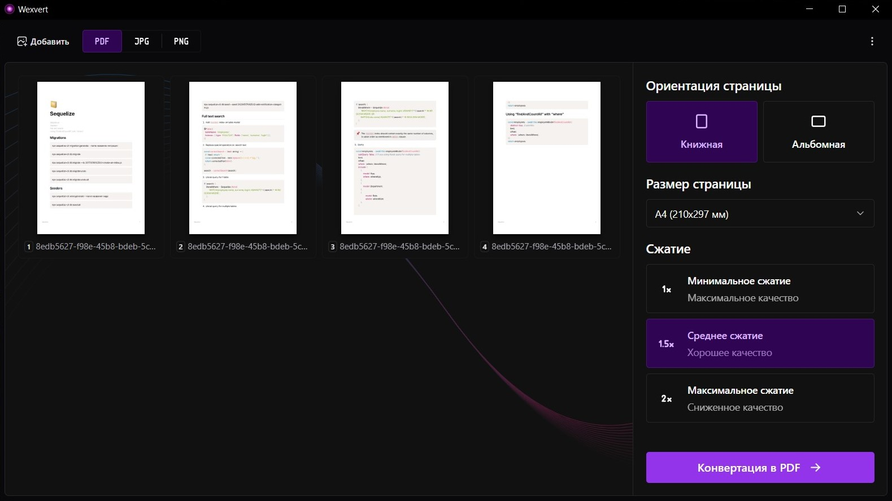

  

<h1 align="center">Wexvert</h1>

  Быстрый конвертер изображений и PDF прямо из контекстного меню Windows

  
  
  
  

---

## 🚀 Последняя версия

[Скачать Wexvert](https://github.com/Evernayt/wexvert/releases/latest/download/Wexvert-setup.exe)

---

## ✨ Возможности

**Wexvert** помогает быстро подготовить изображения и PDF-файлы: конвертировать, сжимать и настраивать документы перед сохранением.

### 🖱 Конвертация из контекстного меню

Конвертируйте файлы прямо из Проводника Windows:

- без ручного открытия приложения;
- без лишних окон и сложных настроек;
- прямо из контекстного меню файла;

### 🔄 Конвертация форматов

Приложение поддерживает исходные файлы:

`jpg`, `png`, `webp`, `tiff`, `heic`, `heif`, `pdf`, `svg`, `bmp`, `jfif`, `gif`

Доступные форматы экспорта:

- `JPG`
- `PNG`
- `PDF`

### 🗜 Сжатие файлов

Уменьшайте размер исходного файла без лишних действий.  
Удобно для отправки по почте, загрузки на сайты, хранения документов и быстрой передачи изображений.

### 📄 Работа с PDF

Для PDF-файлов доступны дополнительные настройки:

- поворот страниц;
- выбор формата листа;
- экспорт в удобный формат.

---

## 🖥 Системные требования

- Windows 10 или новее
- .NET 10 Desktop Runtime

Если приложение не запускается, установите **.NET 10 Desktop Runtime** с официального сайта Microsoft:

https://dotnet.microsoft.com/download/dotnet/10.0

---

## 📦 Поддерживаемые форматы

| Исходный формат | Конвертация в JPG | Конвертация в PNG | Конвертация в PDF | Сжатие |
|---|:---:|:---:|:---:|:---:|
| JPG / JPEG | ✔ | ✔ | ✔ | ✔ |
| PNG | ✔ | ✔ | ✔ | ✔ |
| WEBP | ✔ | ✔ | ✔ | ✔ |
| TIFF | ✔ | ✔ | ✔ | ✔ |
| HEIC / HEIF | ✔ | ✔ | ✔ | ✔ |
| JFIF | ✔ | ✔ | ✔ | ✔ |
| GIF | ✔ | ✔ | ✔ | ✔ |
| SVG | ✔ | ✔ | ✔ | ✔ |
| PDF | ✔ | ✔ | ✔ | ✔ |
| BMP | ✔ | ✔ | ❌ | ✔ |

---

## 🖼 Интерфейс

---

## 📄 Лицензия

Приложение распространяется как бесплатное программное обеспечение.  
Используемые сторонние библиотеки распространяются по собственным лицензиям.

См. `LICENSE` и `THIRD_PARTY_LICENSES.md`.

---

  Сделано для быстрой и удобной работы с изображениями и PDF

